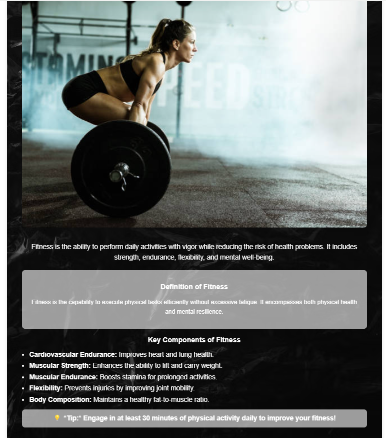
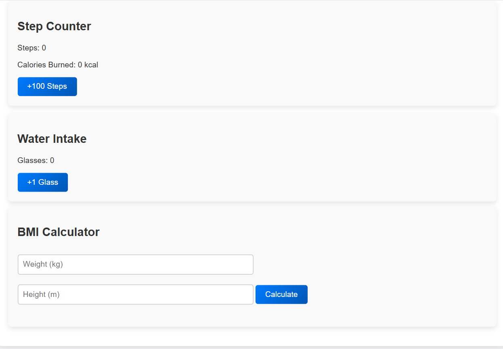

# Calm Fit 🎯

## Basic Details
### Team Name: Codechic!

### Team Members
- Member 1: Adithy Chandran- CEMP
- Member 2: Devika Shaji - CEMP
- Member 3: Abhinanda D Ajay - CEMP

### Hosted Project Link
[ https://devika27306.github.io/Calm-Fit/]

### Project Description
"Calm Fit" is an interactive fitness web application that allows the users to calculate their Step counter-Calorie calculator,Water Intake tracker,and Body mass index (BMI).The website aims to make fitness assessment quick and easy for everyone.

### The Problem statement
In the busy lives we lead,calculating BMI manually can be cumbersome and confusing.And also people usually forgets to drink water which is an essential part of maintaining their health.

### The Solution
We've built a simple and efficient web tool to calculate BMI with just a few  inputs.And also have made a tool to track the intake of water in a day and step counter which calculates how much calories you've burned in every 100 steps.

## Technical Details
### Technologies/Components Used
For Software:
- Languages used  : JavaScript
- Frameworks used : Html, CSS
- Tools used      : Vs Code

### Implementation
For Software:

# Installation Steps

 1. Clone the repository : git clone https://github.com/tinkerhub/tink-her-hack-3-temp.git

# Run
1. Open the index.html file in any modern browser to get started!

### Project Documentation
For Software:

# Screenshots 

# Here's the welcoming home screen!

# Here's how the app recommends the actions based on Step-Counter,Water Intake and BMI results,making your fitness journey easier.

## Team Contributions
- Adithy Chandran : Developed HTML structure and handled JavaScript for thr BMI calculation logic.

- Devika Shaji: Focused on CSS styling, ensuring a responsive and user-friendly design.

- Abhinanda D Ajay: Managed the overall project setup and testing, ensuring seamless user experience.

💡 Why Calm Fit?

We believe that fitness should be simple and fun! By taking the complexity out of BMI calculations, we’ve made it easier than ever for you to track your health. With just a few inputs, you can get instant feedback and tips to improve your fitness journey. It's simple, it's smart, it's Calm Fit! ✨

---
Made with ❤️ at TinkerHub
